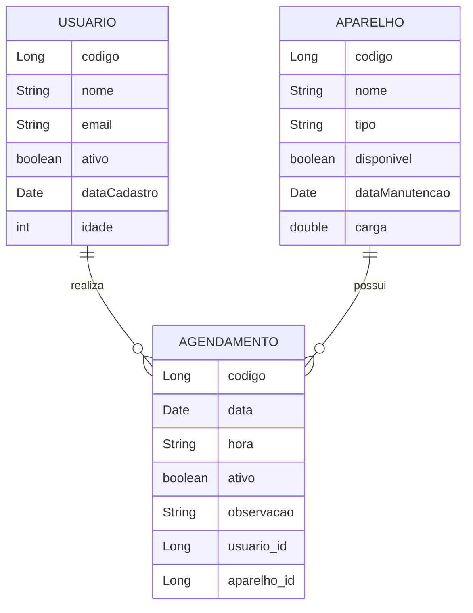

```mermaid
erDiagram

    USUARIO {
        Long codigo
        String nome
        String email
        boolean ativo
        Date dataCadastro
        int idade
    }

    APARELHO {
        Long codigo
        String nome
        String tipo
        boolean disponivel
        Date dataManutencao
        double carga
    }

    AGENDAMENTO {
        Long codigo
        Date data
        String hora
        boolean ativo
        String observacao
        Long usuario_id
        Long aparelho_id
    }

    USUARIO ||--o{ AGENDAMENTO : realiza
    APARELHO ||--o{ AGENDAMENTO : possui
```
